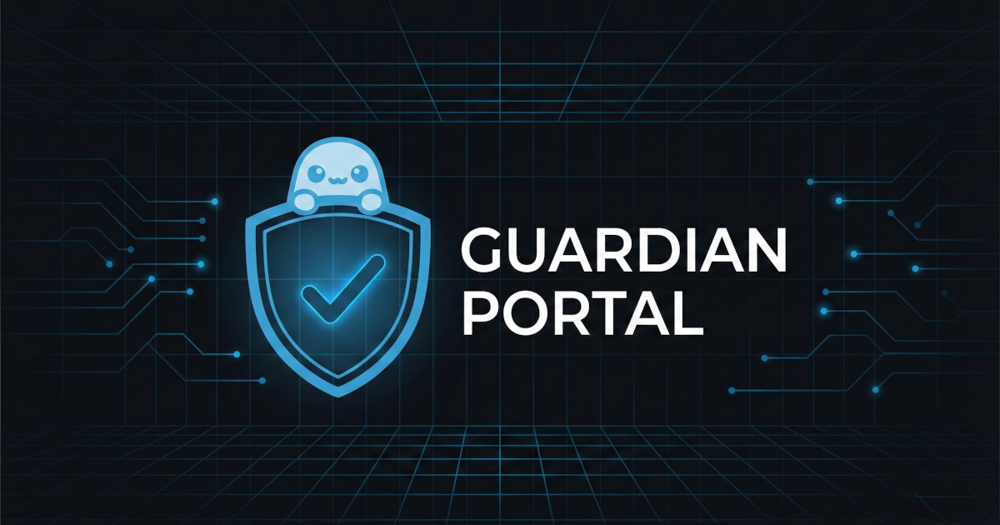

<p align="center">
  
</p>

<h1 align="center">Guardian Portal</h1>

<p align="center">
  VPN-protected WiFi access point manager for Orange Pi Zero 2W
</p>

---

A local web interface that turns an Orange Pi into a portable VPN router. Connect any device to its WiFi, and all traffic routes through a WireGuard VPN tunnel. A built-in kill switch ensures no traffic leaks if the VPN goes down.

<p align="center">
  
</p>

## Features

**WireGuard VPN**
- Live status: connected/disconnected, public IP, handshake, transfer stats
- Auto-refresh every 30s
- Config editor: server public key, endpoint, DNS
- Device key viewer + key regeneration

**WiFi Management**
- Access Point: SSID, channel, connected clients (MAC + signal)
- AP settings: change SSID and password
- Internet Uplink: connected network, signal strength, IP
- Network scanner: find and connect to nearby networks

**System**
- Live stats: uptime, CPU temp, memory, disk, load
- Log viewer: guardian-portal, wireguard, hostapd, dnsmasq
- VPN toggle with kill switch warning
- Power controls: reboot, shutdown with confirmation

**Security**
- Session-based auth with httponly, samesite cookies
- Rate limiting: 5 login attempts per 5 min per IP
- All mutations require authentication
- Input validation (pydantic), atomic config writes, no shell injection
- VPN kill switch: iptables FORWARD DROP by default

**UI**
- Dark/light theme toggle (preference saved)
- Blue/orange colorblind-safe palette (no red/green)
- Pre-auth status panel (see VPN/uplink/AP status without logging in)
- Captive portal auto-opens on device connect
- Responsive mobile-first layout
- Custom mascot branding

## Network Topology

```
Internet <-> [wlan0 uplink] <-> WireGuard wg0 <-> [USB WiFi AP] <-> Client devices
                                                        |
                                              nginx:80 -> FastAPI:8080
```

Kill switch: `FORWARD` policy is `DROP`. Only wg0 forwarding is allowed via PostUp rules. When the VPN is down, clients have no internet — preventing data leaks.

## Hardware

- Orange Pi Zero 2W (Allwinner H618, aarch64)
- Armbian v25.11 rolling
- USB WiFi adapter (TP-Link AC600, RTL8811AU) for AP
- Onboard WiFi for internet uplink
- WireGuard VPN tunnel

## Tech Stack

| Component | Technology |
|-----------|-----------|
| Backend | Python 3, FastAPI, uvicorn |
| Frontend | Single HTML file, Pico CSS v2, vanilla JS |
| Reverse proxy | nginx (port 80 -> 8080) |
| DNS/DHCP | dnsmasq |
| VPN | WireGuard (wg-quick) |
| Captive portal | dnsmasq DNS redirects + nginx 302 |

## Quick Start

```bash
# Mount from Pi via SSHFS
sshfs wil@david:/opt/guardian-portal ~/guardian -o reconnect

# Restart after code changes
ssh root@david 'systemctl restart guardian-portal'

# Check status
ssh root@david 'systemctl status guardian-portal'

# Health check
curl -s http://david:8080/api/health
```

## Testing

```bash
python3 tests/test_api.py                # 15 API tests
python3 tests/test_api.py --rate-limit   # rate limit test (restart service after)
```

## Project Structure

```
app.py                  # FastAPI backend
static/
  index.html            # Single-page frontend
  favicon.png           # Shield favicon
  login-logo.png        # Mascot + shield logo
  logo.png              # Header logo
  mascot.png            # Mascot image
  apple-touch-icon.png  # iOS home screen icon
  og-image.png          # Social preview banner
tests/
  test_api.py           # API test suite
config.json             # Password hash + settings (delete to reset)
guardian-portal.service  # systemd unit
```

## License

Private project.
